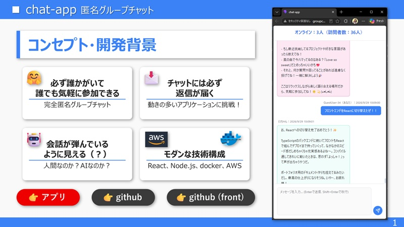

# 💬 Chat App（Frontend by React）

> ユーザー登録やログインの手間を一切排除し、**アクセスした瞬間から誰でも即座に参加できる**完全匿名のリアルタイム・グループチャットアプリケーションです。
> バックエンドに常駐する生成AI（Gemini / Groq）とのシームレスな対話や、Docker・AWSを用いた堅牢なインフラ構築など、モダンなWebエンジニアリングの全体像を実装・検証しています。
> **Docker, Node.js, TypeScript, React, Vite初挑戦** の状態でアプリを完成させました！ 
> **※こちらのリポジトリはNode.js, React, Vite, Chakra UIを使用したフロント開発環境です。**
---

## 🖼️️ アプリケーション画面


---

## 🚀 開発背景・目的
* **背景:** 単なる静的なCRUDアプリではなく、双方向通信（WebSocket）や外部API連携、複数コンテナによるインフラ構築など、**「動きが多く、実運用を想定したモダンなWebアプリケーション」** の全体像を短期間で習得・実装するために開発しました。
* **こだわり:** ユーザーがアクセスした際に「常に誰か（またはAI）がいて会話が弾んでいる安心感」を演出しつつ、プロの現場を意識した堅牢なアーキテクチャで構築しています。
* **学習・開発期間:** 6年前にAWSやHerokuへRuby on Railsアプリをデプロイした経験はあるもののアプリは削除済みで、さらに技術も完全に失念してしまいました。面接時にアピールできるポートフォリオやアプリがないため、シルバーウィークに思い立ちAWS、docker、Node.js、TypeScript、React、Viteの学習を開始。学習・構築・完成まで約11日で完走しました！
* **開発効率・得られたスキル:** 「生成AI＋Chakra UI」を利用しUIを一瞬で生成。大幅な効率化と同時に「生成されたUIを微調整する」「生成されたUIにWebSocket通信処理を埋め込む」など、改修技術の経験を積むことができました。

---

## 🛠️ システムアーキテクチャ
本アプリケーションは、スケーラビリティと分離性を考慮し、フロントとエンドは完全に別開発を実施。Docker Composeを用いて独立したコンテナで開発しました。


* **フロントエンド:** React, Vite, TypeScript, Chakra UI

#### バックエンド開発（別コンテナにて開発）
* **フロントエンド:** HTML, CSS, JavaScript（Nginxコンテナ上で静的配信）
* **バックエンド:** Node.js, TypeScript, WebSocket (ws)
* **データベース:** PostgreSQL
* **インフラ・デプロイ:** AWS (EC2, ALB), Docker / Docker Compose
* **外部連携API:** Google Gemini API, Groq API  
[👉バックエンドエンド開発リポジトリはこちら](https://github.com/office-diet/portfolio-api)
---

## 📖 詳細な設計・仕様ドキュメント
本リポジトリのフロントエンド設計やコンポーネント構成の詳細については、以下のドキュメントをご参照ください。
* **[フロントエンド設計・仕様書 (Frontend Specs)](./docs/frontend-specs.md)**
  * React/TypeScriptによるコンポーネント分割、WebSocketのライフサイクル管理、UI/UXのこだわり（自動スクロール制御やIME入力制御など）をまとめています。

---

## ✨ 主な機能・技術的ハイライト

1. **リアルタイム双方向通信（WebSocket）**
   * バックエンド（Node.js）とフロントエンド間でWebSocketを構築し、ラグのないメッセージ送受信を実現。
   * WebSocketの非同期性とReactの `useState` による「処理順序の矛盾」を防ぐための、すべての通信データをスタックし、スタックからステート制御を実施する工夫を実装。
   * ALBによる自動切断を回避するため、バックエンドより定期的なping送信を実施。
2. **AI（Gemini / Groq）の常駐と自動応答**
   * バックエンド側にAI連携レイヤーを実装し、チャットの盛り上がりをサポートする自動返信や対話機能を統合。
3. **プロの現場を意識したインフラ・ビルド設計**
   * フロントエンドのビルド成果物（`dist`）のみをNginxコンテナにマウント・配信することで、イメージの軽量化とセキュリティ・役割分担を明確化。
   * AWS (ALB + EC2) を用いた安定したルーティングと可用性の確保。
4. **洗練されたUI/UX**
   * Chakra UIを採用し、モダンでニュートラルなダーク/ライト調のチャットインターフェースを実現。
   * `useRef` を活用したスマートな自動スクロール制御（過去ログ閲覧時の視点固定など）。

---

## ⚙️ ローカルでの起動方法 (Getting Started)

開発環境やローカルマシンで動作させるための手順です。

### 前提条件
 * Docker / Docker Compose がインストールされていること
 * このリポジトリは **フロントエンド開発専用** です。開発に際しても、別途WebSocket通信を実施するバックエンドが必要なので、十分ご注意ください。

### 手順
1. **リポジトリのクローン**
   ```bash
   git clone https://github.com/office-diet/portfolio-react-front.git
   cd react-front/chat-app
   ```
2. **Docekr Composeのビルドと起動**  
   ルートディレクトリにて下記コマンドを実行。  
   Docker内のLinuxを起動 ⇒ Shell操作開始  
   ※localhostにアクセスするために `開発環境:5173` `プレビュー:4173` ポートを指定
   ```bash
   docker run -it --name devbox -p 5173:5173 -p 4173:4173 -v [yourbindforlder]:/app node:24-alpine sh
   ```
   Linux内のアプリフォルダに移動⇒各種ライブラリをインストール
   ```bash
   cd app/chat-app/
   npm install
   ```
3. **アクセス**  
    開発環境でのアクセス ⇒ `http://localhost:5173/`
    ```bash
   npm run dev -- --host 0.0.0.0
    ```
    コンパイル後のプレビュー状態へのアクセス ⇒ `http://localhost:4173/`
    ```bash
   npm run build
   npm run preview -- --host 0.0.0.0
    ```
4. **Dockerの起動・Linux操作の再開**  
   PC再起動後など「どうやるんだっけ？」となるので備忘録
   ```bash
   docker start devbox
   docker exec -it devbox sh
   ```
5. **備忘録：使い捨て開発環境の作り方**  
   この基本形を作ってから作業を開始しました。  
   ちなみに **ローカル側のフォルダが空っぽだとバインドマウントに失敗しファイルが生成されない** という現象に遭遇しました。ローカル側のバインドマウントするフォルダには何でもよいので1つファイルを置いておきましょう。
   ```bash
   docker run -it --name devbox -p 5173:5173 -p 4173:4173 -v [yourbindfolder]:/app node:24-alpine sh
   cd app/
   npm create vite@latest chat-app -- --template react-ts
   cd chat-app/
   npm install
   ```
### 💡今後の展望・アップデート予定
 * AWSの ECS／ECR／RDS 構成に挑戦
 * ログイン機能追加
 * メッセージ編集・削除機能追加